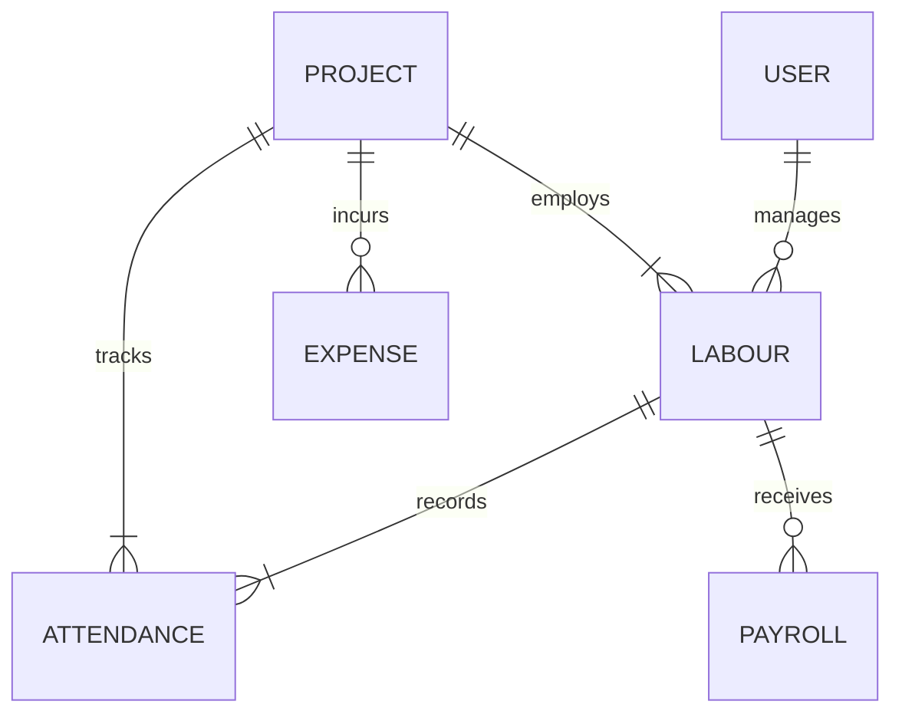

# Database ER Diagram

This document details the relational data relationships within the **Construction Labour Management System**.

## Schema Models and Relationships

- **User**: Authentication, Roles (Admin, Site Manager, Corporate Auditor).
- **Project**: Location, Budget, Timeline, Assigned Site Managers.
- **Labour**: Name, Profile, Skills, Wage Details, Assigned Project.
- **Attendance**: Date, Check-In, Check-Out, Geo-location, Status (Present, Absent, Leave).
- **Payroll**: Calculated Wages, Paid Date, Working Days, Overtime Hours.
- **Expense**: Amount, Category, Receipt Image, Approval Status.
